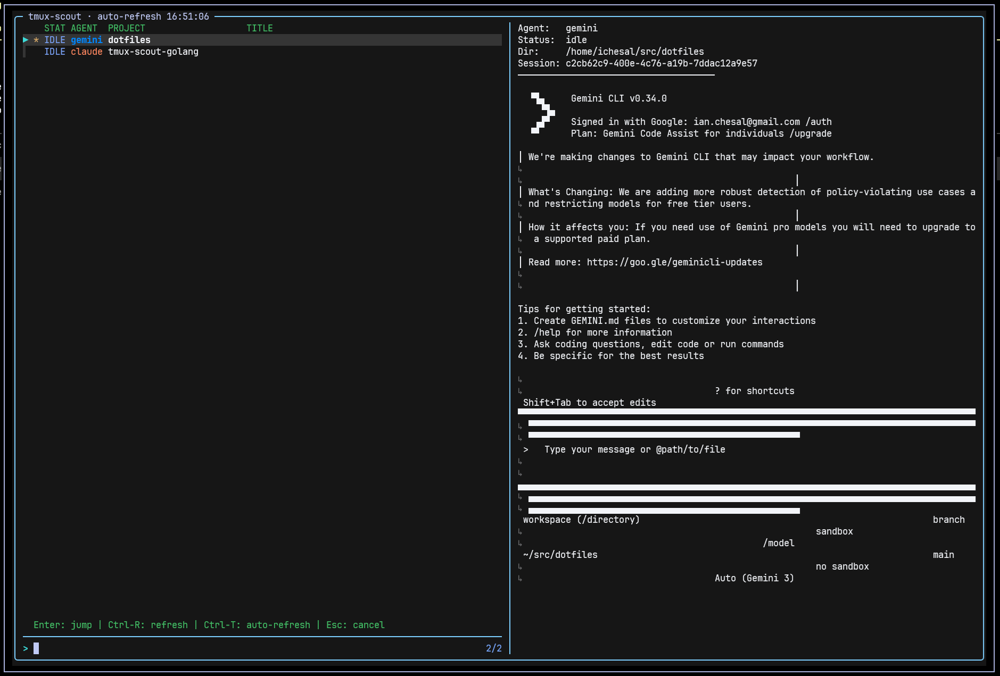

# tmux-scout-golang

[](https://github.com/ianchesal/tmux-scout-golang/actions/workflows/ci.yml)
[](https://github.com/ianchesal/tmux-scout-golang/actions/workflows/security.yml)
[](https://goreportcard.com/report/github.com/ianchesal/tmux-scout-golang)
[](https://github.com/ianchesal/tmux-scout-golang/releases/latest)
[](LICENSE)



This started out as a Golang rewrite of [tmux-scout](https://github.com/qeesung/tmux-scout). All credit for the genesis of this belongs to [qeesung](https://github.com/qeesung). 

A tmux plugin for monitoring and navigating [Claude Code](https://docs.anthropic.com/en/docs/claude-code), [Codex](https://github.com/openai/codex), and [Gemini CLI](https://github.com/google-gemini/gemini-cli) sessions. Provides a real-time fzf picker to jump between agent panes, a status bar widget showing session counts, and crash detection for dead sessions.

## Upgrading from v0.2.x

**v0.3.0 moves session data and the binary — a one-time migration is required.**

| What changed | Old path | New path |
|---|---|---|
| Session data | `~/.tmux-scout/` | `~/.cache/tmux-scout/` (XDG) |
| Binary | `$PLUGIN_DIR/bin/tmux-scout` | `~/.local/bin/tmux-scout` (symlink, if `~/.local/bin` exists) |

After updating the plugin, reload tmux — you will see a warning message if migration is needed. Then run:

```bash
tmux-scout migrate
```

This moves your data, creates the symlink, and reinstalls hooks in Claude Code, Codex, and Gemini with the correct binary path. It is safe to re-run. See [XDG Support](#xdg-support) for full details.

---

## Features

- **Session picker** — `prefix + O` opens an fzf popup listing all active agent sessions with status tags (`WAIT` / `BUSY` / `DONE` / `IDLE`), project names, prompt titles, and live tool details
- **Pane preview** — right-side preview panel shows a structured header (agent, status, dir, session ID) followed by cleaned terminal output (last 25 lines)
- **Status bar widget** — displays session counts by status (e.g. `0|1|2`) in tmux's status-right, refreshed every 2 seconds
- **Auto-refresh** — enabled by default; `Ctrl-T` toggles automatic picker reload every 2 seconds
- **Crash detection** — dead processes and stale Codex JSONL files are automatically detected and cleaned up

## Requirements

- [tmux](https://github.com/tmux/tmux) >= 3.2
- [fzf](https://github.com/junegunn/fzf) >= 0.51 (with `--listen` and `--tmux` support)

## Installation

### With [TPM](https://github.com/tmux-plugins/tpm)

The binary is downloaded automatically on first load. If the download fails, the plugin falls back to building from source (requires Go).

Add to `~/.tmux.conf`:

```bash
set -g @plugin 'ianchesal/tmux-scout-golang'
```

Press `prefix + I` to install. On the next tmux reload, the binary is downloaded and verified automatically. If the download fails, Go is used to build from source. A failure at either stage shows as a tmux message.

### Manual

```bash
git clone https://github.com/ianchesal/tmux-scout-golang.git ~/.tmux/plugins/tmux-scout-golang
```

Add to `~/.tmux.conf`:

```bash
run-shell ~/.tmux/plugins/tmux-scout-golang/tmux-scout-golang.tmux
```

Reload tmux: `tmux source ~/.tmux.conf`

## Building from Source

Requires Go 1.21+. CI tests against Go 1.21, 1.22, 1.23, and the current stable release.

```bash
git clone https://github.com/ianchesal/tmux-scout-golang.git
cd tmux-scout-golang
make build   # outputs bin/tmux-scout
```

To run tests:

```bash
make test
```

## Releasing

> **Note:** Only repository admins can push `v*` tags. Releases are restricted to admins via GitHub tag protection rules.

Update `.version`, commit and push to `main`, then:

```bash
make tag
```

This checks that the working tree is clean, you're on `main`, there are no unpushed commits, and the tag doesn't already exist — then runs the test suite, creates the tag, and pushes it to trigger the GitHub Actions release workflow.

## Hook Setup

tmux-scout needs hooks installed in Claude Code, Codex, and/or Gemini CLI to track sessions. Run the setup command after installation:

```bash
# SCOUT_DIR is set automatically when the plugin loads — these commands can be copy-pasted directly
eval "$(tmux show-env -g SCOUT_DIR)" && "$SCOUT_DIR/scripts/setup.sh" install

# Install for specific agents only
eval "$(tmux show-env -g SCOUT_DIR)" && "$SCOUT_DIR/scripts/setup.sh" install --claude   # Claude Code only
eval "$(tmux show-env -g SCOUT_DIR)" && "$SCOUT_DIR/scripts/setup.sh" install --codex    # Codex only
eval "$(tmux show-env -g SCOUT_DIR)" && "$SCOUT_DIR/scripts/setup.sh" install --gemini   # Gemini CLI only

# Other operations
eval "$(tmux show-env -g SCOUT_DIR)" && "$SCOUT_DIR/scripts/setup.sh" uninstall          # Remove all hooks
eval "$(tmux show-env -g SCOUT_DIR)" && "$SCOUT_DIR/scripts/setup.sh" status             # Check installation status
```

The installer is **idempotent** — running it multiple times is safe. If you move the repository, re-running install will automatically update hook paths.

### What gets modified

- **Claude Code**: Adds a hook entry to each of the 6 event types in `~/.claude/settings.json`
- **Codex**: Sets the `notify` field in `~/.codex/config.toml` (original notify command is backed up and chained)
- **Gemini CLI**: Adds a hook entry to each of the 7 event types in `~/.gemini/settings.json`

## Usage

### Picker

Press `prefix + O` (default) to open the session picker.

| Key | Action |
|---|---|
| `Enter` | Jump to selected session's pane |
| `Ctrl-R` | Refresh session list |
| `Ctrl-T` | Toggle auto-refresh (every 2s) |
| `Esc` | Close picker |

Each line shows:

```
* BUSY claude  my-project                "implement the login page"  Bash: npm test
```

- `*` — current pane indicator
- `WAIT` / `BUSY` / `DONE` / `IDLE` — session status
- Agent type (claude / codex / gemini)
- Project directory name
- Session title (first prompt)
- Current tool details (for working sessions)

### Status Bar

The status widget is not automatically injected — you need to add it manually. The plugin sets a `SCOUT_DIR` environment variable at load time, so you can use `$SCOUT_DIR` to reference the widget script regardless of install location.

**Without a theme plugin**, add to `~/.tmux.conf`:

```bash
set -g status-right '#($SCOUT_DIR/scripts/status-widget.sh) #S'
set -g status-interval 2
```

**With a theme plugin** (e.g. `minimal-tmux-status`), directly setting `status-right` won't work because the theme overrides it. Use the theme's own option instead:

```bash
# minimal-tmux-status
set -g @minimal-tmux-status-right '#($SCOUT_DIR/scripts/status-widget.sh) #S'
```

The widget shows:

```
W|B|D
```

Where `W` = waiting for attention (red), `B` = busy/working (yellow), `D` = done/completed (green). An optional `I` = idle (blue) appears when idle sessions exist.

## Configuration

### Keybinding

```bash
set -g @scout-key "O"    # default: O (prefix + O)
```

### Picker Size

```bash
set -g @scout_picker_width  85   # default: 85% of terminal width
set -g @scout_picker_height 75   # default: 75% of terminal height
```

### Status Bar

```bash
set -g @scout-status-format '{W}/{B}/{D}'         # custom separators
set -g @scout-status-format '{W} wait {B} busy'   # with labels
```

Placeholders: `{W}` wait, `{B}` busy, `{D}` done, `{I}` idle.

## Data Storage

Session state is stored in `~/.cache/tmux-scout/` by default (XDG-compliant). See [XDG Support](#xdg-support) for full details and migration instructions.

```
~/.cache/tmux-scout/
├── status.json                      # Aggregated session index
├── sessions/                        # Per-session JSON files
│   ├── {session-id}.json
│   └── ...
└── codex-original-notify.json       # Backup of original Codex notify command
```

Sessions older than 24 hours are automatically cleaned up.

## XDG Support

tmux-scout follows the [XDG Base Directory Specification](https://specifications.freedesktop.org/basedir-spec/latest/).

**Data directory** — session state is stored in:

| Condition | Path |
|-----------|------|
| `$XDG_CACHE_HOME` is set | `$XDG_CACHE_HOME/tmux-scout` |
| Default | `~/.cache/tmux-scout` |

**Binary** — after download or build, `~/.local/bin/tmux-scout` is symlinked to the plugin's binary if `~/.local/bin` exists. The symlink updates automatically whenever the plugin downloads or builds a new version.

### Migrating from an older install

If you have existing data in `~/.tmux-scout` from a pre-XDG version, run:

```bash
tmux-scout migrate
```

This will:
1. Move `~/.tmux-scout` → `~/.cache/tmux-scout` (or `$XDG_CACHE_HOME/tmux-scout`)
2. Symlink `~/.local/bin/tmux-scout` → plugin binary (if `~/.local/bin` exists)
3. Reinstall hooks in Claude Code, Codex, and Gemini configs with the new binary path

The migration is safe to re-run and never overwrites existing data at the destination.

## Known Issues

* The Codex path isn't very well tested at this point


## Security

Downloaded binaries are verified against `SHA256SUMS` before installation.

Release binaries also come with a `SHA256SUMS` file for manual verification. To verify before running:

**Linux:**
```bash
sha256sum -c SHA256SUMS
```

**macOS:**
```bash
shasum -a 256 -c SHA256SUMS
```

## See Also

* [qeesung/tmux-scout](https://github.com/qeesung/tmux-scout) -- the genesis for this project came about after they posted this to the r/tmux sub-reddit. I wanted a binary approach to doing what they were doing and took on rewriting it all in Golang. All credit belongs to qeesung for the original idea and implementation here.
* [gavraz/recon](https://github.com/gavraz/recon) -- similar idea but Rust-based. Has a pretty cool Tamagotchi thing going on that I did.
* [tmux-plugins/tmp](https://github.com/tmux-plugins/tpm) -- the Tmux Plugin Manager. It's just easier this way.
* [go.dev](https://go.dev/) -- the Go programming language.


## License

[MIT](LICENSE)
